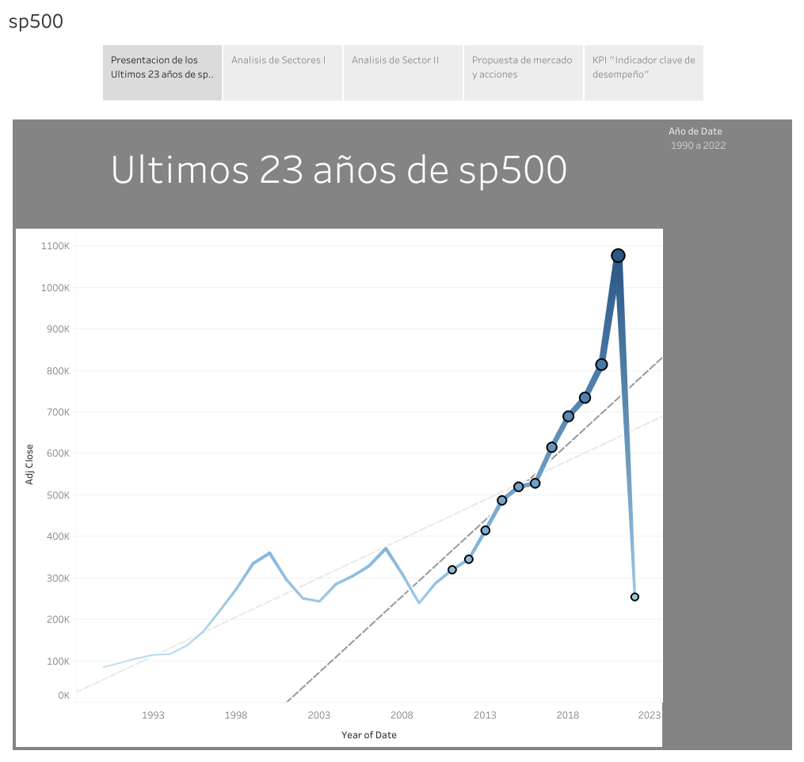

<h1 align='center'>
 <b>PROYECTO INDIVIDUAL Nº2 siendo un Data Analyst</b>
</h1>

# <h1 align="center">**`Mercado bursátil sp500`**</h1>

`Análisis Exploratorio de los datos`(_Exploratory Data Analysis = EDA_):

Cree un EDA en jupyter notebook para obtener datos de distintas fuentes sobre sp500 y poder hacer un analisis financiero
de los ultimos 23 años.
Trabaje con distintas fuentes y cree mi teoria sobre cual es la mejor inversion con los tiempos que corren

`Dashboard`:

Gracias a Tableau creo varios dashboard y pude crear un storyteling para explcar mi analisis.

Esta el powerpoint para una vista rapida o el link a Tableau para un analisis interactivo

`KPIs`:

Cree un KPI "Indicador clave de desempeño" para tener opcion de inversion y saber cuando invertir y cuando vender en distintas
empresas y sectores

## Fuente de datos:

- Para este trabajo se utilizará la API de yahoo finance, la cual posee su librería https://pypi.org/project/yfinance/ y
  pagina oficial https://finance.yahoo.com/

- [Lista índice SP500](https://www.google.com/url?q=https://en.wikipedia.org/wiki/List_of_S%2526P_500_companies&sa=D&source=docs&ust=1676566032938438&usg=AOvVaw3J6gZYtEH8xJABTCf0pYqO)

## Vista rapida del storytelling 
[descargar sp500.pdf ](tableau/sp500.pdf)

**Presentacion de los ultimos 23 años de sp500**

**Analisis de Sector**
.png)

**Propuesta de mercado y acciones**
.png)

**KPI *indicador de desempeño***
.png)

## Link a Tableau para usar el Dashboard interactivamente
[sp500](https://public.tableau.com/views/sp500_analyst/Story1?:language=en-US&:display_count=n&:origin=viz_share_link)